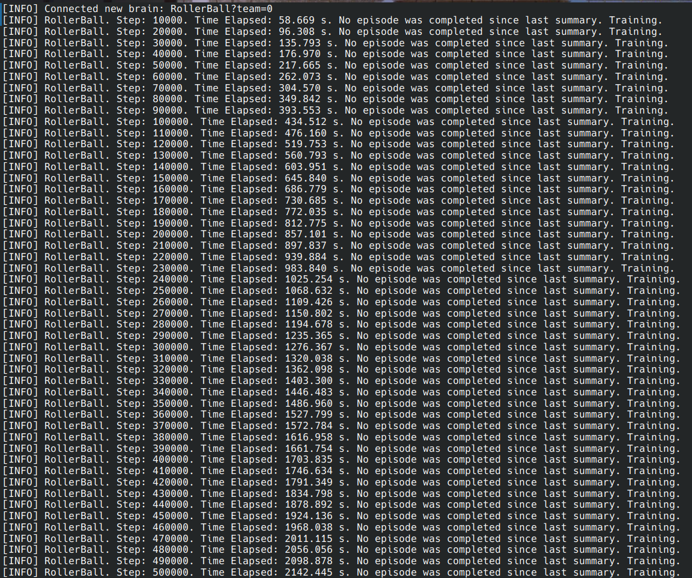
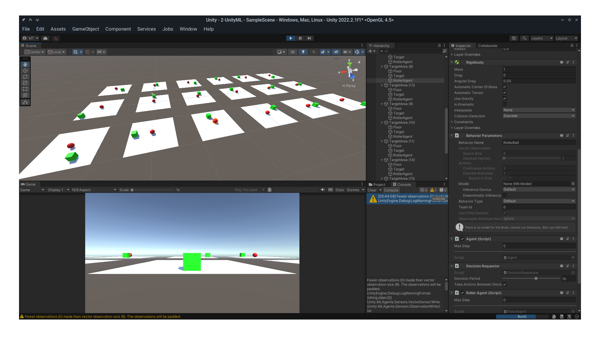
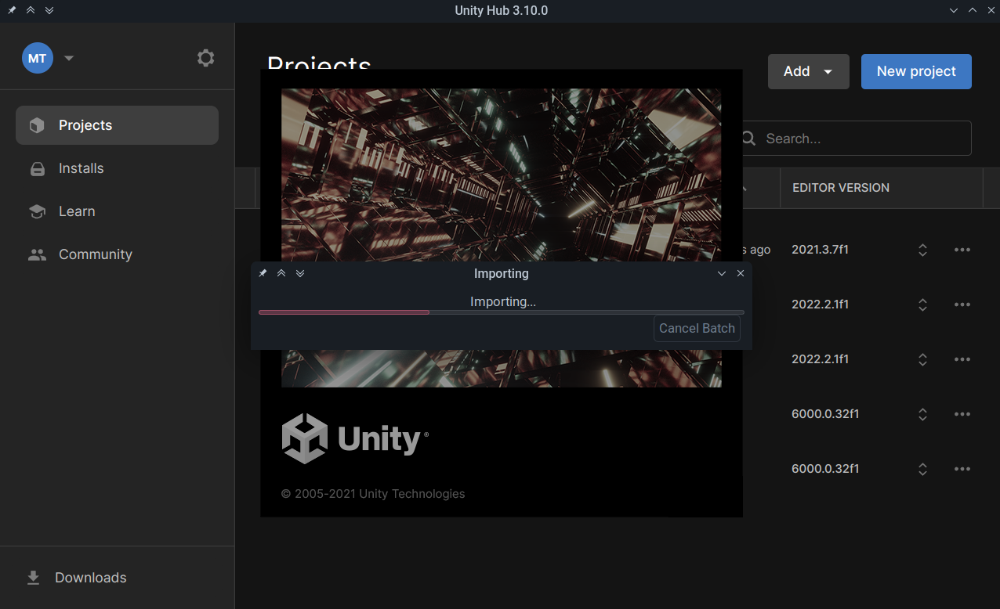

# АНАЛИЗ ДАННЫХ И ИСКУССТВЕННЫЙ ИНТЕЛЛЕКТ В РАЗРАБОТКЕ ИГР

Отчет по лабораторной работе #5 выполнил:

- Торопов Матвей Николаевич
- РИ230931

Отметка о выполнении заданий (заполняется студентом):

| Задание | Выполнение | Баллы |
| ------ | ------ | ------ |
| Задание 1 | # | 60 |
| Задание 2 | * | 20 |
| Задание 3 | * | 20 |

знак "*" - задание выполнено; знак "#" - задание не выполнено;

Работу проверили:

- к.т.н., доцент Денисов Д.В.
- к.э.н., доцент Панов М.А.
- ст. преп., Фадеев В.О.

Структура отчета

- Данные о работе: название работы, фио, группа, выполненные задания.
- Цель работы.
- Задание 1.
- Код реализации выполнения задания. Визуализация результатов выполнения (если применимо).
- Задание 2.
- Код реализации выполнения задания. Визуализация результатов выполнения (если применимо).
- Задание 3.
- Код реализации выполнения задания. Визуализация результатов выполнения (если применимо).
- Выводы.
- ✨Magic ✨

## Цель работы

Познакомиться с программными средствами для создания системы машинного обучения и ее интеграции в Unity.

## Предисловие

Возможно я сделал что-то не так, но первый пример никак не поддавался обучению. Все эпохи нейросети происходили с результатом «no episode was completed», причём запускал обучение я несколко раз и на разных количествах объектов. Безрезультатно, как уже можно понять.

Второй же проект отказывался запускаться в принципе, висела долга-долга плашка Import, после которой ничего не наступало, никакого индикатора прогресса или чего-либо ещё я так и не дождался

В связи с чем лабораторную работу выполняю на основе теоретических знаний.

## Задание 1

### Найдите внутри C# скрипта “коэффициент корреляции ” и сделать выводы о том, как он влияет на обучение модели

## Задание 2

### Изменить параметры файла yaml-агента и определить какие параметры и как влияют на обучение модели. Привести описание не менее трех параметров

#### learning_rate

Определяет, насколько сильно обновляются веса нейросети при каждом шаге обучения. Высокое значение ускоряет обучение, но может привести к нестабильности и пропуску оптимальных значений. При низких значениях обучение более точное, но проходит медленнее

#### buffer_size

Определяет, сколько данных собирается перед обновлением модели. Больший буфер позволяет агенту анализировать более разнообразные состояния перед обновлением, что делает обучение более стабильным, но слишком большой буфер может замедлить обновление модели и сделать обучение менее адаптивным к изменениям.

#### gamma

Fпределяет, насколько агент учитывает будущие награды. Большое означает, что агент придаёт большое значение будущим наградам, что стимулирует долгосрочное планирование. При более низких значениях агент больше фокусируется бы на краткосрочных выгодах.

## Задание 3

### Проанализировать примеры и придумать примеры использования в реальных проектах

В 1 примере ML-агент используется для поиска пути, что является весьма распространённой задачей в играх  
В частности, ML-агент может использоваться для поиска пути:

- врагов: к игроку
- спутников: к игроку
- скопления нипов: для предотвращения столкновений

Использование ML-агента позволяет добится более быстрого алгоритма поиска пути в различных сложных окружениях (много различных препятствий), часто обновляемых или вообще процедурно-генерируемых (потому что нельзя заранее предсказать по какому маршруту должен двигаться моб)

Во 2 примере ML-агент симулирует добычу ресурса и его транспортировку. Это полезно в различных случаях, например:

- при симуляции рыночной экономики, где более умные НИПы могут получать больше выгоды от взаимодействия с другими НИПами или игроками
- В играх, где сложность поведения НИПов должна расти со временем, для увеличения общей сложности игры

## Вывод

В процессе работы я ознакомился со способом обучения Unity ML-Agent и рассмотрел его теоретическое применение в различных сферах в дизайне и разработке игр

| Plugin | README |
| ------ | ------ |
| Dropbox | [plugins/dropbox/README.md][PlDb] |
| GitHub | [plugins/github/README.md][PlGh] |
| Google Drive | [plugins/googledrive/README.md][PlGd] |
| OneDrive | [plugins/onedrive/README.md][PlOd] |
| Medium | [plugins/medium/README.md][PlMe] |
| Google Analytics | [plugins/googleanalytics/README.md][PlGa] |

## Powered by

**BigDigital Team: Denisov | Fadeev | Panov**
